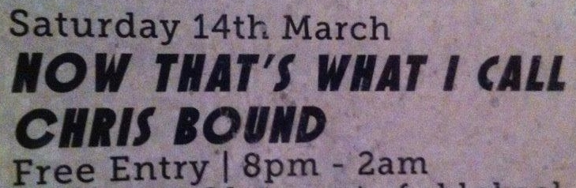

  

 
<h1 align="center"><b>Hullo all! 👋 I'm Chris.👋</b></h1>
<h2 align="center"><em>I'm a Tokyo based developer currently attempting to embiggen my cromulent full stack knowledge.</em></h2>
 
 
<h1 align="center"><b>👇🏻Some stuffs about me👇🏻</b></h1>

  (〜￣▽￣)〜📧   cpbound87@gmail.com

  (〜￣▽￣)〜📧   <a href="https://www.linkedin.com/in/christian-bound">A wild LinkedIn appears!</a>

  (〜￣▽￣)〜🎸   <a href="https://adulttime.bandcamp.com/releases">I make weird music too. Enjoy!</a>

  (〜￣▽￣)〜🕹️   I play Tekken 7. Lucky Chloe / Asuka Kazama main here.😰

  

<!--
**cpbound/cpbound** is a ✨ _special_ ✨ repository because its `README.md` (this file) appears on your GitHub profile.

Here are some ideas to get you started:

- 🔭 I’m currently working on ...
- 🌱 I’m currently learning ...
- 👯 I’m looking to collaborate on ...
- 🤔 I’m looking for help with ...
- 💬 Ask me about ...
- 📫 How to reach me: ...
- 😄 Pronouns: ...
- ⚡ Fun fact: ...
-->
